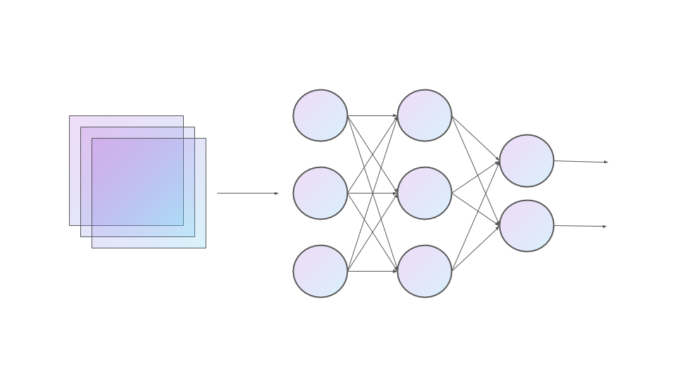
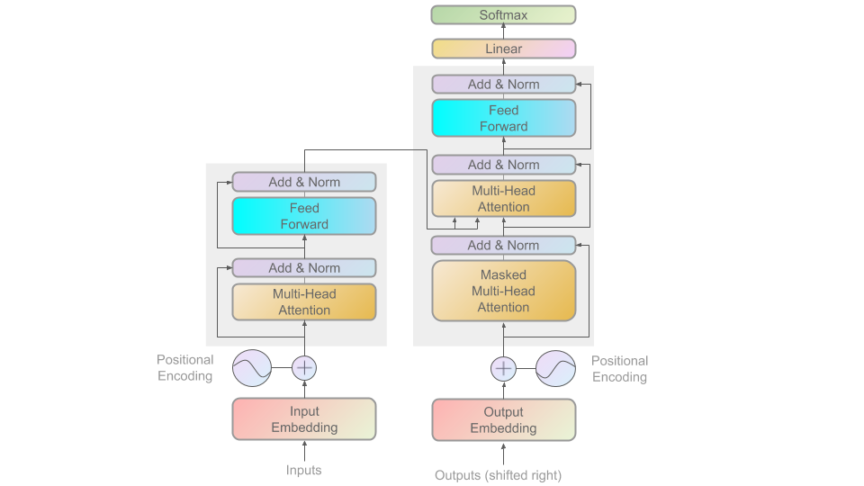
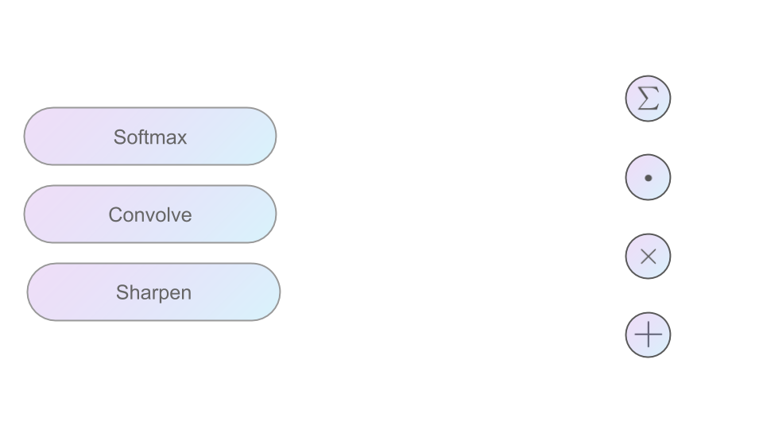

# ML Visuals

📣 Stay tuned for significant updates to both the slides and repository.!!!

📣 In the meantime, [Join our Discord](https://discord.gg/SKgkVT8BGJ)

[ML Visuals](https://docs.google.com/presentation/d/11mR1nkIR9fbHegFkcFq8z9oDQ5sjv8E3JJp1LfLGKuk/edit?usp=sharing) is a new collaborative effort to help the machine learning community in improving science communication by providing free professional, compelling and adequate visuals and figures. Currently, we have over 100 figures (all open community contributions). You are free to use the visuals in your machine learning presentations or blog posts. You don’t need to ask permission to use any of the visuals but it will be nice if you can provide credit to the designer/author (author information found in the slide notes). Check out the versions of the visuals below. 

This is a project made by the [dair.ai](https://dair.ai/) community. The latest version of the Google slides can be found in this GitHub repository. Our community members will continue to add more common figures and basic elements in upcoming versions. Think of this as free and open artifacts and templates which you can freely and easily download, copy, distribute, reuse and customize to your own needs.

ML Visuals is now being used to power 100s of figures used by master/PhD students, papers (like this [one](https://arxiv.org/abs/2010.05113)), among other use cases. 

## How to Use?

Essentially, we are using Google Slides to maintain all visuals and figures (check the versions below). To add your own custom figures, simply add a new slide and reuse any of the basic visual components (remember to request edit permissions). You can also create your own copy of the slides and customize whatever you like. We encourage authors/designers to add their visuals here and allow others to reuse them. Make sure to include your author information (in the notes section of the slide) so that others can provide credit if they use the visuals elsewhere (e.g. blog/presentations). Also, provide a short description of your visual to help the user understand what it is about and how they can use it. If you need "Edit" permission, just click on the "request edit access" option under the "view only" toolbar (in Google Slides) or send me an email at ellfae@gmail.com.

Downloading a figure from any of the slides is easy. Just click on File→Download→(choose your format).

If you need help with customizing a figure or have an idea of something that could be valuable to others, we can help. Just open an issue [here](https://github.com/dair-ai/ml-visuals/issues/new) and we will do our best to come up with the visual. Thanks.

Feel free to reach out to me on [Twitter](https://twitter.com/omarsar0) for an invite to our Slack group.

## Versions:
- [Version 1.0](https://docs.google.com/presentation/d/11mR1nkIR9fbHegFkcFq8z9oDQ5sjv8E3JJp1LfLGKuk/edit?usp=sharing)

## How to Contribute?
- You can check out our [Project page](https://github.com/orgs/dair-ai/projects/8) to see all the ongoing tasks or issues related to this research project. Lookout for the main `ml_visuals` tag. Issues with the `good first issue` tag are good tasks to get started with.
- You can also just check the [issues tab](https://github.com/dair-ai/ml-visuals/issues).
- You can ask anything related to this project in our Slack group
- Slack channel: #ml_visuals

**Some ideas for figures to add to the Slides** ([issue](https://github.com/dair-ai/ml-visuals/issues/14))

- [ ] Linear regression, single-layer neural network
- [ ] Multilayer Perceptron with hidden layer
- [ ] Backpropagation
- [ ] Batch Normalization and alternatives
- [ ] Computational Graphs
- [ ] Dropout
- [ ] CNN - padding, stride, pooling,... 
- [ ] LeNet
- [ ] AlexNet
- [ ] VGG
- [ ] GoogleNet
- [ ] ResNet
- [ ] DenseNet
- [ ] Memory Networks
- [ ] RNN
- [ ] Deep RNN
- [ ] Bidirectional RNN
- [ ] GRU
- [ ] LSTM
- [ ] Language RNN models
- [ ] Backpropagation through time
- [ ] Encoder-Decoder Architecture
- [ ] Seq2seq with RNN encoder-decoder
- [ ] Bearm search and other decoding strategies
- [ ] Attention
- [ ] Multi-head attention
- [ ] Self-attention
- [ ] Transformer
- [ ] Word2vec/GloVe/Skip-gram/CBOW/BERT/GPT....
- [ ] Common/Popular CV/NLP Tasks

List adopted from multiple resources including [nlpoverview](https://nlpoverview.com/index.html) and [d2l.ai](https://d2l.ai/) which both contain a very solid syllabus.  

## Examples of Visuals

